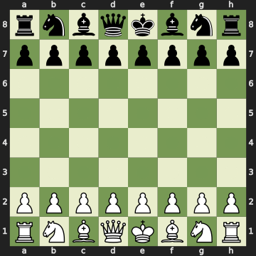

# FastChess
Faster and Bug Free Chess engine in C with python api using ctype

FastChess is a high-performance Python chess engine library built using ctypes, providing significant speed improvements over traditional Python chess libraries like python-chess. This library is designed for speed and efficiency, making it suitable for use in applications requiring rapid chess move generation and analysis.

## Features

- **High Performance**: FastChess leverages ctypes to interface with a C chess backend, resulting in significantly faster move generation and analysis compared to pure Python implementations.
  
- **Ease of Use**: The library provides a simple and intuitive API for performing common chess operations such as generating legal moves.

- **Modular Design**: FastChess is designed with modularity in mind, allowing users to easily extend and customize its functionality to suit their specific needs.

- **SVG**: FastChess support svg just like python-chess library.
- 

## Installation

To install FastChess, simply clone the repository and run the setup script:

```bash
git clone https://github.com/thefcraft/FastChess.git
cd FastChess
python setup.py install
```

## Usage

Here's a basic example of how to use FastChess to generate legal moves for a given position:

```python
from FastChess import Board

# Create a new Board instance
board = Board(fen="rnbqkbnr/pppppppp/8/8/8/8/PPPPPPPP/RNBQKBNR w KQkq - 0 1")

# Generate legal moves for the current position
legal_moves = board.generate_moves()

# Print the legal moves
for move in legal_moves:
    print(move)
```

## Speed Comparison (chess vs fastchess)

### legal_moves generator
`%timeit -n 1000000 board.legal_moves`

249 ns ± 11.5 ns per loop (mean ± std. dev. of 7 runs, 1,000,000 loops
each)

`%timeit -n 1000000 fastboard.legal_moves()`

203 ns ± 45.9 ns per loop (mean ± std. dev. of 7 runs, 1,000,000 loops
each)


### legal_moves list
`%timeit -n 10000 list(board.legal_moves)`

55.7 µs ± 9.5 µs per loop (mean ± std. dev. of 7 runs, 10,000 loops 
each)

`%timeit -n 10000 list(fastboard.legal_moves()`

19.4 µs ± 2.92 µs per loop (mean ± std. dev. of 7 runs, 10,000 loops 
each)


### copy state
`%timeit -n 100000 board.copy()`

3.34 µs ± 255 ns per loop (mean ± std. dev. of 7 runs, 100,000 loops 
each)

`%timeit -n 100000 fastboard.copy()`

1.64 µs ± 255 ns per loop (mean ± std. dev. of 7 runs, 100,000 loops 
each)

### push move
`move = list(board.legal_moves)[0];`

`%timeit -n 100000 board.copy().push(move)`

13.6 µs ± 2.63 µs per loop (mean ± std. dev. of 7 runs, 100,000 loops 
each)

`move = list(fastboard.legal_moves())[0];`

`%timeit -n 100000 fastboard.copy().push(move)`

3.03 µs ± 638 ns per loop (mean ± std. dev. of 7 runs, 100,000 loops 
each)

### piece at square

`%timeit -n 10000 [board.piece_at(square) for square in chess.SQUARES]`

35.3 µs ± 3.97 µs per loop (mean ± std. dev. of 7 runs, 10,000 loops 
each)

`%timeit -n 10000 [fastboard.piece_at_raw(square) for square in
range(64)]`

44.3 µs ± 9.06 µs per loop (mean ± std. dev. of 7 runs, 10,000 loops 
each)


## Contributing

Contributions to FastChess are welcome! If you encounter any bugs, have feature requests, or would like to contribute code, please open an issue or submit a pull request on GitHub.

## License

FastChess is licensed under the [MIT License](https://github.com/git/git-scm.com/blob/main/MIT-LICENSE.txt).
